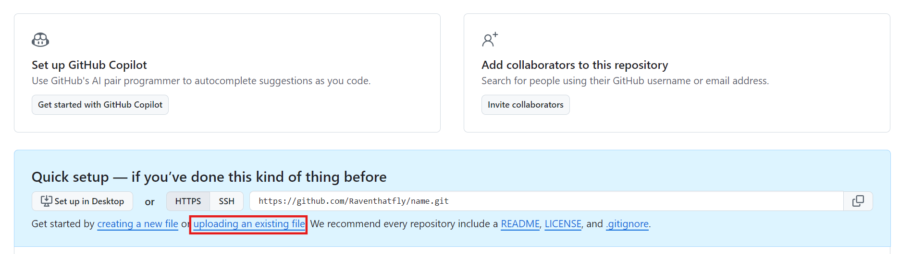

# Homework 2

---
***作业不要出现任何形式的中文路径！可能会导致Makefile或者Cmake报错！***

### Task1 

In the current `Makefile`, only funtction `foo()` is compiled, you should edit `Makefile` so that function `bar()` will also complie. After you modify your code, use `cd` command to enter `projectMake` directory. Execute the following:

```bash
make myprogram
./myprogram
```
***The program does not execute if Makefile is not modified properly.***

If you want to clean the executables, type in:
```bash
make clean
```

### Task2

In the current `Cmakelist.txt`, only funtction `foo()` is implemented, you should edit `Cmakelist.txt` so that function `bar()` will also complie. After you modify your code, use `cd` command to enter `projectCmake` directory. Execute the following:

```bash
mkdir build
cd build
cmake -G "MinGW Makefiles" ..
make
./myprogram
```
***The program does not execute if Makefile is not modified properly.***

If you want to clean the executables, type in:
```bash
make clean
```


If you want to clean the Cmake cache files, remove all the files in the `build` directory.

### Task3

Please setup a github account. 

After an account is set up, create a repo:


Enter repo name(Whatever you like).


Create.


Try to upload whatever file you like. For me, I'll upload `1.txt`.


Press commit changes after upload is complete.

Copy this line:


Open a terminal and clone it somewhere:


Modify `1.txt` what ever you like and save it.

Enter `git status` and what do you see? It should be able to show the files that you modified. You can also add any random files into it and try to git status again.

Enter `git add -A`.

Enter `git commit -m "anystring"`.

Want to know what these commands are doing? Search on the internet or ask ChatGPT!

You can try `git push` to push your modified code onto github. You will probably fail, even if you enter the corroect account and password. If you want to know how to push, try to search what ssh keys are and how to setup github ssh keys. There are abundant resources on the internet to tell you what to do. After ssh keys are set properly, you should be able to see that your modified code is on github.